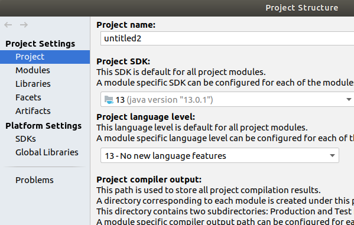
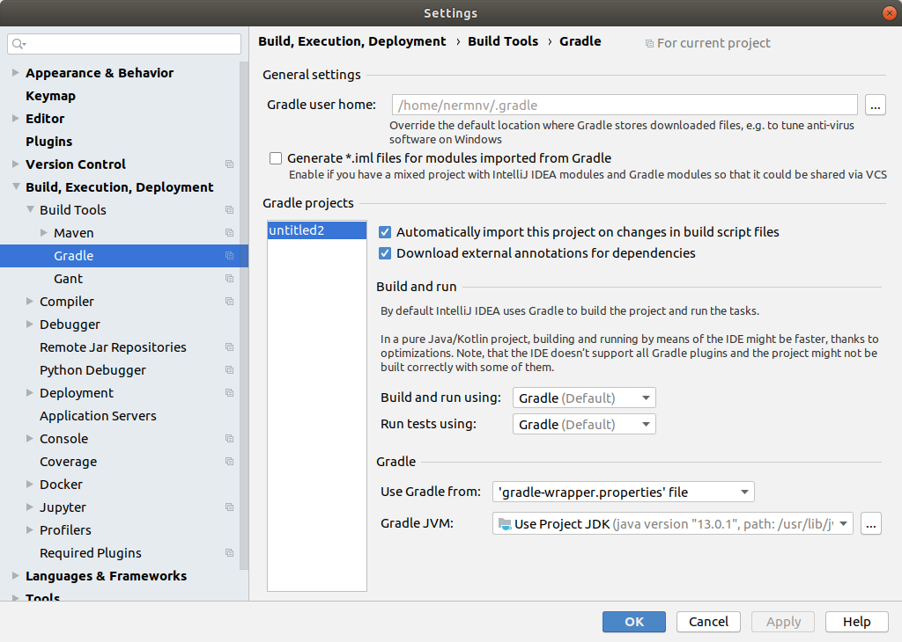

# How to run on INTELLIJ

set JDK13 in `File -> Project Structure...` 

check `File -> Settings... -> Build, Execution, Deployment -> Build Tools -> Gradle -> Gradle JVM` set it to match project or specific jdk 
